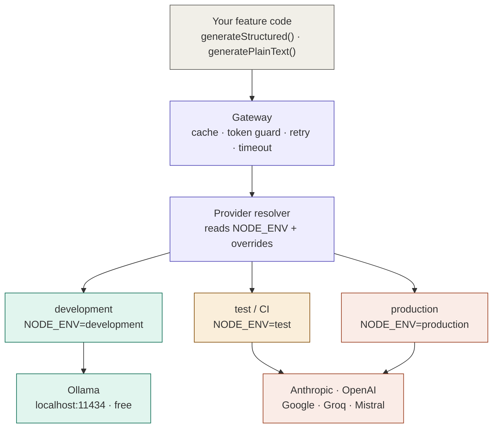

# @jz92/ai-provider

A zero-config AI routing layer for Node.js and Next.js projects.

Import one function — get Ollama locally and any cloud provider in production, automatically, based on `NODE_ENV`. No provider-switching logic in your feature code, ever.

| Environment | Provider | Model | Cost |
|---|---|---|---|
| `development` | Ollama (local) | `qwen2.5-coder:14b` | $0 |
| `test` / CI | Anthropic | `claude-haiku-4-5` | ~$0.001/req |
| `production` | Anthropic | `claude-sonnet-4-6` | ~$0.03/req |

---

## What this is

When building AI-powered features, you typically want:
- **Local dev** → free, fast, no API key, works offline
- **CI** → real API, cheapest model, minimal tokens
- **Production** → best model, prompt caching, cost-optimised

This package handles that routing. You write `generateStructured()` once — the environment decides which provider runs it.

## What this is not

- Not an agent framework
- Not a coding assistant or CLI tool
- Not something that manages Ollama for you

You bring Ollama. This package talks to it.

---

## Quick setup for a Next.js project

### 1. Install production deps

```bash
npm install @jz92/ai-provider @ai-sdk/anthropic ai zod
```

### 2. Install local dev dep (Ollama)

```bash
npm install ollama-ai-provider --save-dev --legacy-peer-deps
```

> **Why `--legacy-peer-deps`?**
> `ollama-ai-provider@1.2.0` has a peer dependency conflict with `zod@4`.
> This flag is required until `ollama-ai-provider` releases a `zod@4` compatible version.
> This is an upstream issue and **does not affect production** — `devDependencies` are
> never installed on Vercel or AWS.
> Track the upstream issue: [ollama-ai-provider on GitHub](https://github.com/sgomez/ollama-ai-provider)

### 3. Your `package.json` should look like this

```json
{
  "dependencies": {
    "@jz92/ai-provider": "^0.3.2",
    "@ai-sdk/anthropic": "^4.0.0",
    "ai": "^7.0.0",
    "zod": "^4.0.0"
  },
  "devDependencies": {
    "ollama-ai-provider": "^1.2.0"
  }
}
```

This ensures:
- **Vercel / AWS** — `ollama-ai-provider` is never installed, no conflict, clean build
- **Local dev** — `ollama-ai-provider` installed, Ollama runs free at `localhost:11434`

### 4. Set up Ollama locally (first time only)

```bash
# Install Ollama
brew install ollama

# Start as a background service
brew services start ollama

# Pull the default model (~9GB)
ollama pull qwen2.5-coder:14b

# Verify
curl http://localhost:11434   # → Ollama is running
```

### 5. Set environment variables

```bash
# .env.development  (commit the .example, not the real file)
NODE_ENV=development
OLLAMA_BASE_URL=http://localhost:11434
OLLAMA_MODEL=qwen2.5-coder:14b
AI_LOG_USAGE=true

# .env.production   (set as secrets in Vercel / AWS — never commit)
ANTHROPIC_API_KEY=sk-ant-...
```

On Vercel, set `ANTHROPIC_API_KEY` in **Project Settings → Environment Variables**.
`NODE_ENV=production` is set automatically.

### 6. Use it

```typescript
import { generateStructured, generatePlainText } from '@jz92/ai-provider'
import { z } from 'zod'

const result = await generateStructured({
  systemPrompt: 'Extract data. Respond in JSON only.',
  prompt: userInput,
  schema: z.object({ name: z.string(), city: z.string() }),
  cacheKey: `extract:${userInput}`,
})

console.log(result.data)        // { name: 'Alex', city: 'London' }
console.log(result.provider)    // 'ollama' locally · 'anthropic' in prod
console.log(result.fromCache)   // true on cache hit
```

Your code is identical in every environment. The provider switches automatically.

---

## Switching cloud providers

Switching from Anthropic to OpenAI (or any other provider) is one env var and one package:

```bash
npm install @ai-sdk/openai
```

```bash
# .env.production
AI_PROVIDER=openai
OPENAI_API_KEY=sk-...
```

No code changes. Your `generateStructured()` calls are unchanged.

### Supported providers

| Provider | Package | Env var |
|---|---|---|
| Anthropic (default) | `@ai-sdk/anthropic` | `ANTHROPIC_API_KEY` |
| OpenAI | `@ai-sdk/openai` | `OPENAI_API_KEY` |
| Google Gemini | `@ai-sdk/google` | `GOOGLE_GENERATIVE_AI_API_KEY` |
| Groq | `@ai-sdk/groq` | `GROQ_API_KEY` |
| Mistral | `@ai-sdk/mistral` | `MISTRAL_API_KEY` |
| Ollama (local) | `ollama-ai-provider` | — |

---

## Usage

### `generateStructured` — typed JSON output

```typescript
import { generateStructured } from '@jz92/ai-provider'
import { z } from 'zod'

const result = await generateStructured({
  systemPrompt: 'You are a data extraction assistant. Respond in JSON only.',
  prompt: 'Extract name and city from: "Hi I am Alex from London"',
  schema: z.object({ name: z.string(), city: z.string() }),
  cacheKey: 'extract:alex',       // optional — repeat calls skip the API
  maxInputTokens: 4000,           // optional — throws if exceeded
})

console.log(result.data)          // { name: 'Alex', city: 'London' }
console.log(result.provider)      // 'ollama' | 'anthropic' | 'openai' ...
console.log(result.fromCache)     // true if served from response cache
console.log(result.usage)         // { inputTokens, outputTokens, cachedTokens }
```

### `generatePlainText` — unstructured text output

```typescript
import { generatePlainText } from '@jz92/ai-provider'

const result = await generatePlainText({
  systemPrompt: 'You are a helpful assistant.',
  prompt: 'Summarise this in one sentence...',
})

console.log(result.data)  // the text response
```

---

## Environment variables

| Variable | Default | Description |
|---|---|---|
| `NODE_ENV` | `development` | Drives provider selection |
| `AI_PROVIDER` | — | Force a provider: `ollama`, `anthropic`, `openai`, `google`, `groq`, `mistral` |
| `AI_MODEL` | — | Force a specific model string |
| `AI_LOG_USAGE` | `false` | Log provider, model, and token usage to console |
| `AI_TIMEOUT_MS` | `60000` (Ollama) / `30000` (cloud) | Request timeout in ms |
| `AI_CACHE_MAX_SIZE` | `500` | Max in-memory cache entries |
| `AI_CACHE_TTL_MS` | `300000` (5 min) | Cache entry TTL |
| `OLLAMA_BASE_URL` | `http://localhost:11434` | Ollama host |
| `OLLAMA_MODEL` | `qwen2.5-coder:14b` | Local model name |

---

## What's included in the gateway

Every request passes through the gateway regardless of provider:

- **Response cache** — same `cacheKey` skips the API entirely. Bounded at 500 entries, 5 min TTL.
- **Token budget guard** — throws before the API call if input exceeds `maxInputTokens`.
- **Smart retry** — retries only transient errors (429, 500, timeout). Never retries auth or billing failures.
- **Hard timeout** — 60s for Ollama, 30s for cloud. Override with `AI_TIMEOUT_MS`.
- **Prompt caching** — automatically enabled for Anthropic in production. Reduces input costs by ~90% on repeat calls.
- **Usage logging** — formatted terminal output in development showing provider, model, and token counts.

---

## Error handling

```typescript
import { generateStructured, AIProviderError } from '@jz92/ai-provider'

try {
  const result = await generateStructured({ ... })
} catch (err) {
  if (err instanceof AIProviderError) {
    console.error(err.code)    // 'AUTH_ERROR' | 'RATE_LIMIT' | 'TIMEOUT' | etc.
    console.error(err.message) // actionable message with exact steps to fix
  }
}
```

### Error codes

| Code | Cause | Retried? |
|---|---|---|
| `AUTH_ERROR` | Missing or invalid API key | No |
| `BILLING_ERROR` | No credits / quota exceeded | No |
| `RATE_LIMIT` | Too many requests (429) | Yes — with backoff |
| `SERVER_ERROR` | Provider 5xx error | Yes — with backoff |
| `TIMEOUT` | Request exceeded `AI_TIMEOUT_MS` | Yes — once |
| `MODEL_NOT_FOUND` | Model not pulled locally | No |
| `TOKEN_BUDGET` | Input exceeded `maxInputTokens` | No |
| `SCHEMA_VALIDATION` | Output did not match Zod schema | No |

### Ollama not running

```
[ai-provider] Ollama is not reachable at http://localhost:11434.

  Start Ollama:       brew services start ollama
  Or (foreground):    ollama serve

  To use a cloud provider instead:
    Set AI_PROVIDER=anthropic (and ANTHROPIC_API_KEY) in your .env
    Or: AI_PROVIDER=openai    (and OPENAI_API_KEY)
    Or: AI_PROVIDER=groq      (and GROQ_API_KEY — free tier available)
```

### API key not set

```
[ai-provider] ANTHROPIC_API_KEY is not set.

  1. Install the SDK:   npm install @ai-sdk/anthropic
  2. Set the key:
       Local:       add ANTHROPIC_API_KEY=<your-key> to .env.local
       Vercel:      Project Settings → Environment Variables
       AWS:         task definition or Secrets Manager
       GitHub CI:   repo secrets → ${{ secrets.ANTHROPIC_API_KEY }}

  Get a key at: https://console.anthropic.com
```

---

## Architecture



---

## Security

This package reads API keys from environment variables and passes them directly to the provider SDK over HTTPS. Keys are never logged, stored, or transmitted by this package.

- Never commit `.env` or `.env.local` — add both to `.gitignore`
- Never log `process.env` in application code
- Use deployment secrets (Vercel / AWS Secrets Manager) in production
- Rotate keys immediately if accidentally exposed

---

## Running tests

```bash
# Requires Ollama running with qwen2.5-coder:14b pulled
npm test
```

Expected: 27 passed.

---

## Reference implementation

See [portfolio-lab](https://github.com/jithinjohnzachariah92/portfolio-lab) for a working Next.js project using this package across multiple AI-powered features.

---

## Repo

[github.com/jithinjohnzachariah92/ai-provider](https://github.com/jithinjohnzachariah92/ai-provider) · [npmjs.com/package/@jz92/ai-provider](https://www.npmjs.com/package/@jz92/ai-provider)