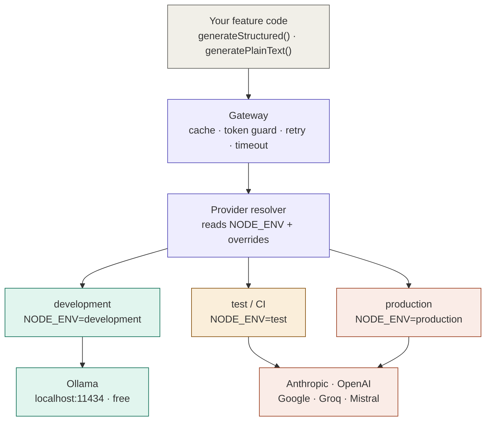

# @jz92/ai-provider

A zero-config AI routing layer for Node.js and Next.js projects.

Import one function — get Ollama locally and Anthropic/OpenAI/Groq in production, automatically, based on `NODE_ENV`. No provider-switching logic in your feature code, ever.

---

## What this is

When building AI-powered features, you typically want:
- **Local dev** → free, fast, no API key, works offline
- **CI** → real API, cheapest model, minimal tokens
- **Production** → best model, prompt caching, cost-optimised

This package handles that routing. You write `generateStructured()` once — the environment decides which provider runs it.

## What this is not

- Not an agent framework
- Not a coding assistant or CLI tool
- Not something that manages Ollama for you

You bring Ollama. This package talks to it.

---

## Prerequisites

For local development you need Ollama installed and running on your machine.

```bash
# Install (macOS)
brew install ollama

# Start as a background service
brew services start ollama

# Pull a model (one-time, ~9GB)
ollama pull qwen2.5-coder:14b
```

Verify it's running:
```bash
curl http://localhost:11434   # should return: Ollama is running
```

For production (Vercel, AWS, etc.) you only need an API key from your chosen provider — no Ollama required.

---

## Installation

```bash
npm install @jz92/ai-provider
```

After install, a setup guide prints automatically telling you exactly which peer deps to install based on the providers you want to use. The short version:

```bash
# Always required
npm install ai zod

# Local dev (free, no API key)
npm install ollama-ai-provider

# Cloud — install only the provider(s) you use
npm install @ai-sdk/anthropic    # → ANTHROPIC_API_KEY
npm install @ai-sdk/openai       # → OPENAI_API_KEY
npm install @ai-sdk/google       # → GOOGLE_GENERATIVE_AI_API_KEY
npm install @ai-sdk/groq         # → GROQ_API_KEY
npm install @ai-sdk/mistral      # → MISTRAL_API_KEY
```

**Only install adapters for providers you actually use.** Unused ones are never loaded — the package uses dynamic imports so missing adapters don't cause errors unless you try to use them.

**Switching providers later is one env var change** — `AI_PROVIDER=openai` — no code changes needed in your feature files.

---

## Usage

```typescript
import { generateStructured, generatePlainText } from '@jz92/ai-provider'
import { z } from 'zod'

// Structured output — returns validated, typed JSON
const result = await generateStructured({
  systemPrompt: 'Extract data. Respond in JSON only.',
  prompt: 'My name is Jithin and I live in Maidenhead.',
  schema: z.object({ name: z.string(), city: z.string() }),
  cacheKey: `extract:${input}`,   // optional — skips API on repeat calls
})

console.log(result.data)        // { name: 'Jithin', city: 'Maidenhead' }
console.log(result.provider)    // 'ollama' locally · 'anthropic' in prod
console.log(result.fromCache)   // true on cache hit

// Plain text output
const result = await generatePlainText({
  systemPrompt: 'You are a helpful assistant.',
  prompt: 'Summarise this in one sentence...',
})
```

Your code is identical in every environment. The provider switches automatically.

---

## How routing works

| `NODE_ENV` | Provider | Model | Cost |
|---|---|---|---|
| `development` | Ollama (local) | `qwen2.5-coder:14b` | $0 |
| `test` / CI | Anthropic | `claude-haiku-4-5` | ~$0.001/req |
| `production` | Anthropic | `claude-sonnet-4-6` | ~$0.03/req |

Override anything with env vars:

```bash
# Force a specific provider
AI_PROVIDER=openai npm run dev

# Force a specific model
AI_MODEL=gpt-4o npm run dev

# Use a custom Ollama model variant
OLLAMA_MODEL=my-custom-model npm run dev
```

---

## Setting your API key

Keys are read from environment variables at runtime. The package never sees or stores them.

### Local dev — no key needed
Ollama runs entirely on your machine. Just set `NODE_ENV=development` (the default).

```bash
# .env.development
NODE_ENV=development
OLLAMA_BASE_URL=http://localhost:11434
OLLAMA_MODEL=qwen2.5-coder:14b
AI_LOG_USAGE=true
```

### Production — Vercel
Set one environment variable in your Vercel project dashboard:
```
ANTHROPIC_API_KEY = sk-ant-...
```
`NODE_ENV=production` is set automatically by Vercel. Done.

### Production — AWS (ECS / Lambda / EC2)
```bash
ANTHROPIC_API_KEY=sk-ant-...
NODE_ENV=production
```

### CI — GitHub Actions
```yaml
env:
  NODE_ENV: test
  ANTHROPIC_API_KEY: ${{ secrets.ANTHROPIC_API_KEY }}
```

### Supported provider keys

| Provider | Env var |
|---|---|
| Anthropic | `ANTHROPIC_API_KEY` |
| OpenAI | `OPENAI_API_KEY` |
| Google | `GOOGLE_GENERATIVE_AI_API_KEY` |
| Groq | `GROQ_API_KEY` |
| Mistral | `MISTRAL_API_KEY` |

---

## Environment variables

| Variable | Default | Description |
|---|---|---|
| `NODE_ENV` | `development` | Drives provider selection |
| `AI_PROVIDER` | — | Force a provider: `ollama`, `anthropic`, `openai`, `google`, `groq`, `mistral` |
| `AI_MODEL` | — | Force a specific model string |
| `AI_LOG_USAGE` | `false` | Log provider, model, and token usage to console |
| `AI_TIMEOUT_MS` | `60000` (Ollama) / `30000` (cloud) | Request timeout in ms |
| `AI_CACHE_MAX_SIZE` | `500` | Max in-memory cache entries |
| `AI_CACHE_TTL_MS` | `300000` (5 min) | Cache entry TTL |
| `OLLAMA_BASE_URL` | `http://localhost:11434` | Ollama host |
| `OLLAMA_MODEL` | `qwen2.5-coder:14b` | Local model name |

---

## Architecture



---

## What's included in the gateway

Every request passes through the gateway regardless of provider:

- **Response cache** — same `cacheKey` skips the API entirely. Bounded at 500 entries, 5 min TTL. Configurable via env vars.
- **Token budget guard** — estimates input size and throws before the API call if it exceeds the limit. Set `maxInputTokens` per call.
- **Smart retry** — retries only transient errors (rate limit, server error, timeout). Never retries auth or billing failures — those won't recover and would waste money.
- **Hard timeout** — 60s for Ollama (model load time), 30s for cloud. Override with `AI_TIMEOUT_MS`.
- **Prompt caching** — automatically enabled for Anthropic in production. Marks the system prompt for server-side caching, reducing input costs by ~90% on repeat calls.

---

## Custom Ollama model variants

You can bake your system prompt into a named local model using an Ollama `Modelfile`. This mirrors what prompt caching does in production — the stable context is paid once, not on every request.

```dockerfile
# modelfiles/Modelfile.my-feature
FROM qwen2.5-coder:14b

SYSTEM """
Your stable system prompt here.
Respond only in JSON.
"""

PARAMETER temperature 0.1
PARAMETER num_predict 1024
```

```bash
ollama create my-feature -f modelfiles/Modelfile.my-feature
```

```bash
# .env.development
OLLAMA_MODEL=my-feature
```

A `Modelfile.template` is included at `node_modules/@jz92/ai-provider/modelfiles-template/Modelfile.template`.

---

## Security

This package reads API keys from environment variables and passes them directly to the provider SDK over HTTPS. Keys are never logged, stored, or transmitted by this package.

Your responsibilities as a consumer:

- Never commit `.env` or `.env.local` — add both to `.gitignore`
- Never log `process.env` in application code
- Use `.env.example` with placeholder values for documentation
- Use deployment secrets (Vercel dashboard / AWS Secrets Manager) in production
- Rotate keys immediately if accidentally exposed

---

## Error handling

The package throws `AIProviderError` with a typed `code` and a clear actionable message. You never see raw SDK errors.

```typescript
import { generateStructured, AIProviderError } from '@jz92/ai-provider'

try {
  const result = await generateStructured({ ... })
} catch (err) {
  if (err instanceof AIProviderError) {
    console.error(err.code)    // 'AUTH_ERROR' | 'BILLING_ERROR' | 'RATE_LIMIT' | etc.
    console.error(err.message) // tells you exactly what to do
  }
}
```

### Error codes

| Code | Cause | Retried? |
|---|---|---|
| `AUTH_ERROR` | Missing or invalid API key | No |
| `BILLING_ERROR` | No credits / quota exceeded | No |
| `RATE_LIMIT` | Too many requests (429) | Yes — with backoff |
| `SERVER_ERROR` | Provider 5xx error | Yes — with backoff |
| `TIMEOUT` | Request exceeded `AI_TIMEOUT_MS` | Yes — once |
| `MODEL_NOT_FOUND` | Model not pulled locally | No |
| `TOKEN_BUDGET` | Input exceeded `maxInputTokens` | No |
| `SCHEMA_VALIDATION` | Output did not match Zod schema | No |

### Ollama not running

```
[ai-provider] Ollama is not reachable at http://localhost:11434.

  Start Ollama:       brew services start ollama
  Or (foreground):    ollama serve

  To use a cloud provider instead:
    Set AI_PROVIDER=anthropic (and ANTHROPIC_API_KEY) in your .env
    Or: AI_PROVIDER=openai    (and OPENAI_API_KEY)
    Or: AI_PROVIDER=groq      (and GROQ_API_KEY — free tier available)
```

### API key not set

```
[ai-provider] ANTHROPIC_API_KEY is not set.

  1. Install the SDK:   npm install @ai-sdk/anthropic
  2. Set the key:
       Local:       add ANTHROPIC_API_KEY=<your-key> to .env.local
       Vercel:      Project Settings → Environment Variables
       AWS:         task definition or Secrets Manager
       GitHub CI:   repo secrets → ${{ secrets.ANTHROPIC_API_KEY }}

  Get a key at: https://console.anthropic.com
```

---

## Running tests

```bash
# Requires Ollama running with qwen2.5-coder:14b pulled
npm test
```

Expected: 23 passed.

---

## Publishing

```bash
npm run build
npm publish --access public
```

---

## Repo

[github.com/jithinjohnzachariah92/ai-provider](https://github.com/jithinjohnzachariah92/ai-provider)
